# PCBs

NOTE: Unless otherwise specified, **all of these boards are UNTESTED**!

## TODO
* ESP32 with onboard level shifting
* DoubleWing Color Screen with buttons

## Adafruit DoubleWing INA219x4 (quad) Ammeter
Hopefully similar to Adafruit's INA219 FeatherWing (https://www.adafruit.com/product/3650)

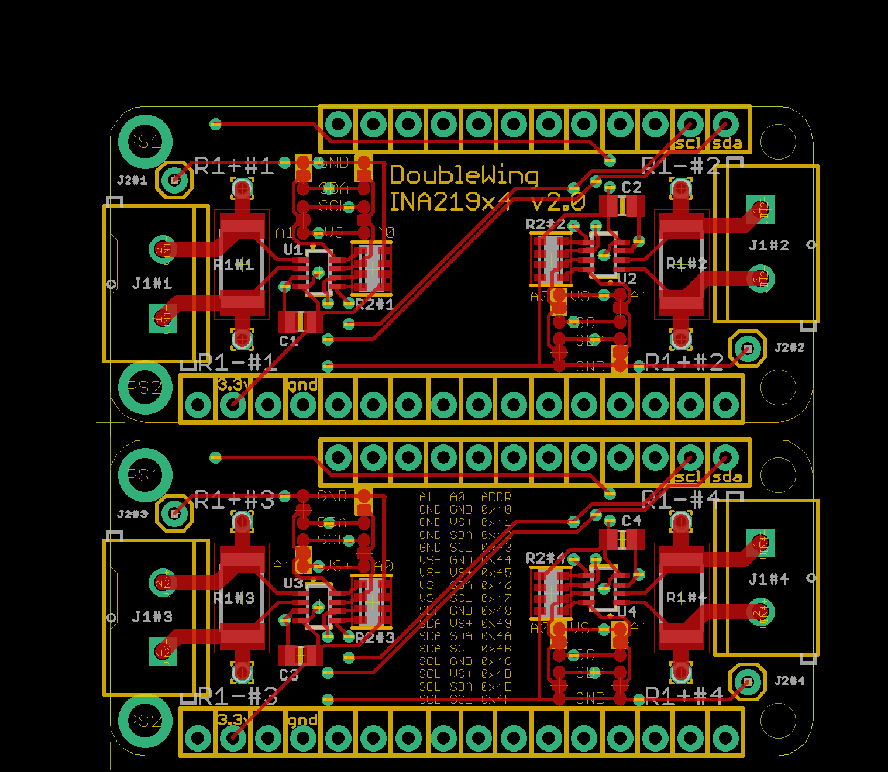
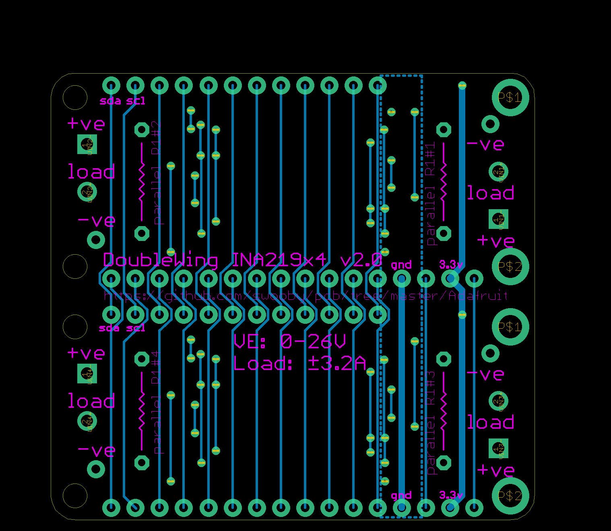
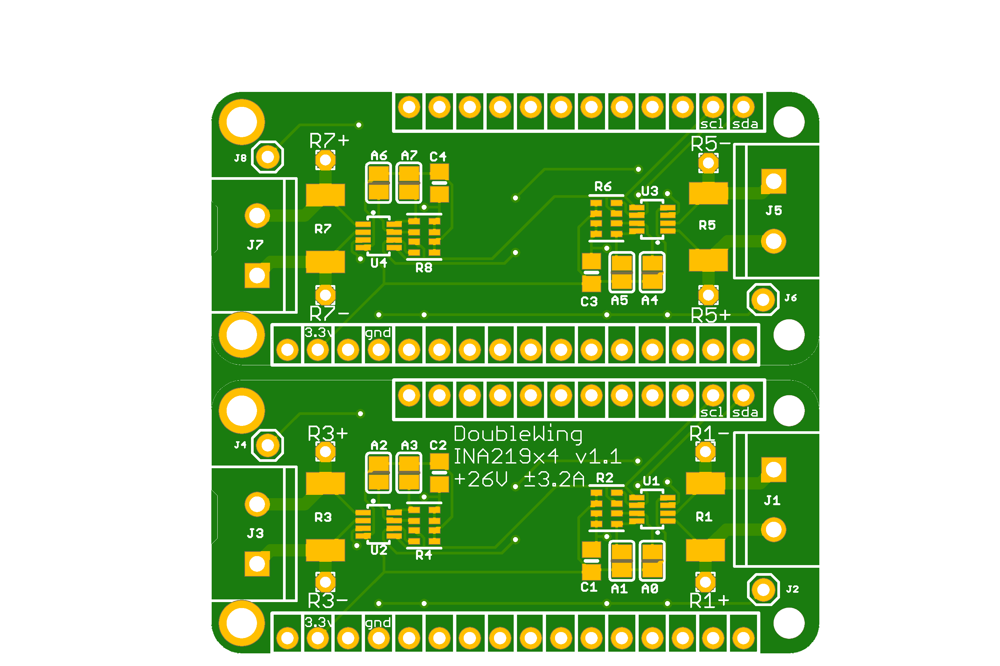
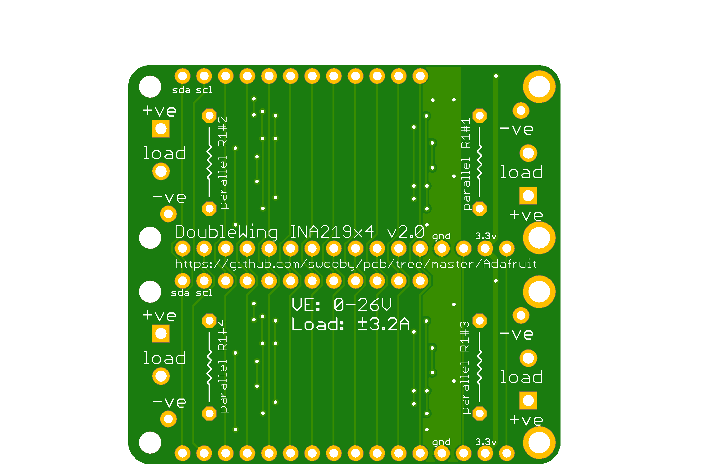

## Adafruit FeatherWing INA219x2 (dual) Ammeter
...

## TinyPICO INA219 Ammeter
Hopefully similar to Adafruit's INA219 FeatherWing (https://www.adafruit.com/product/3650)

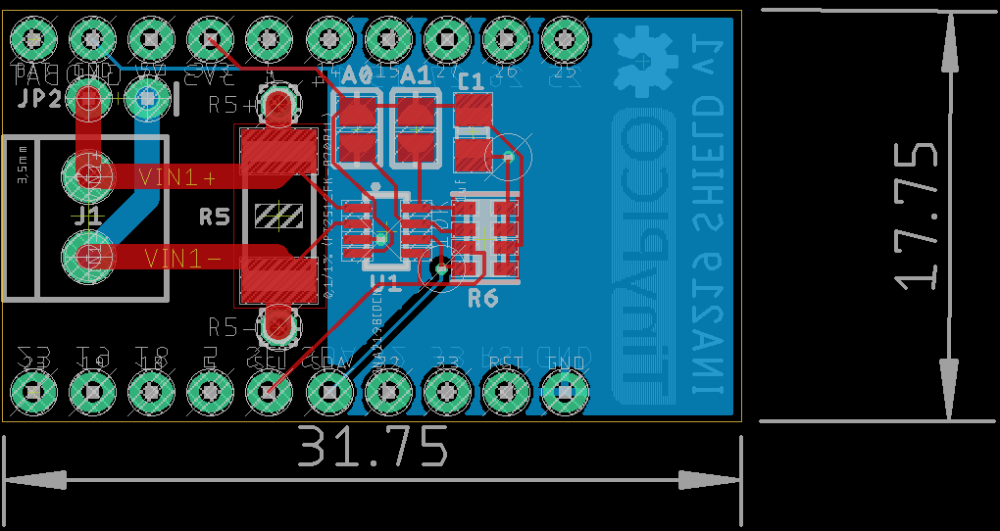
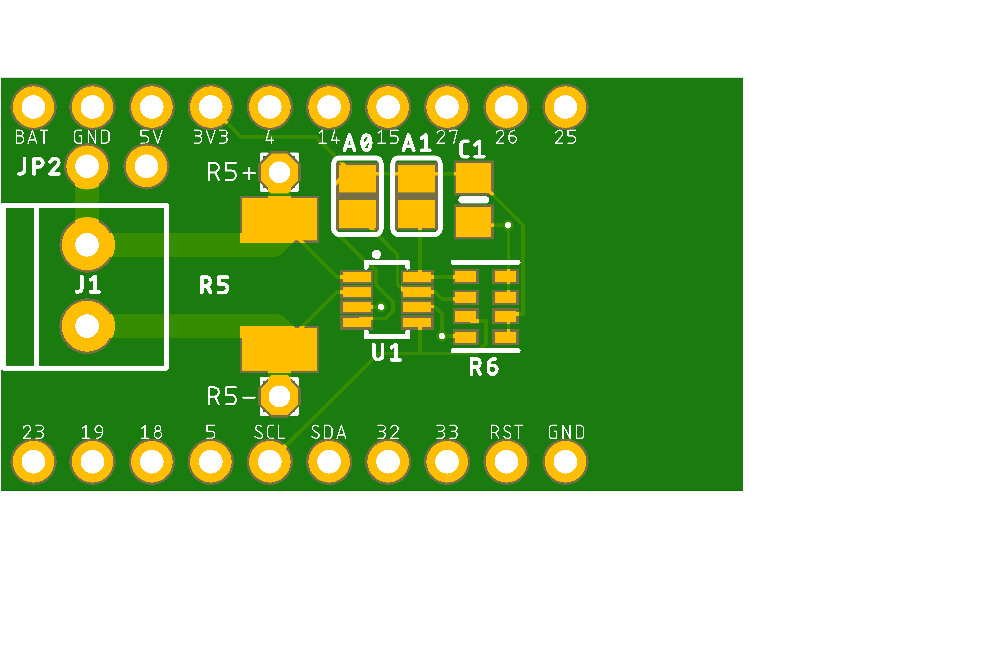
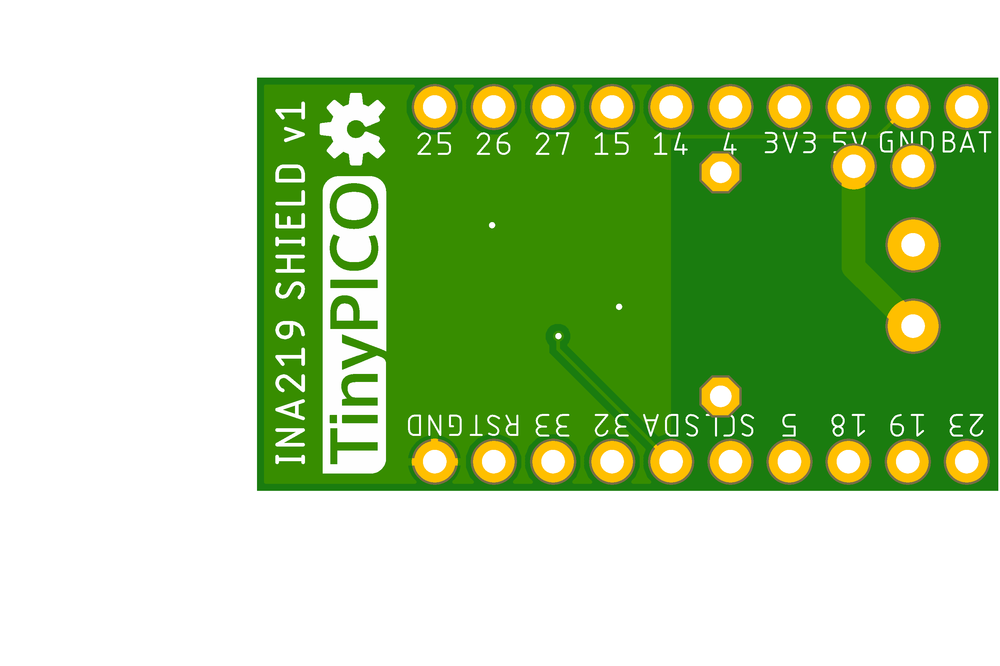

## TinyPICO 74HCT245 Level Shifter

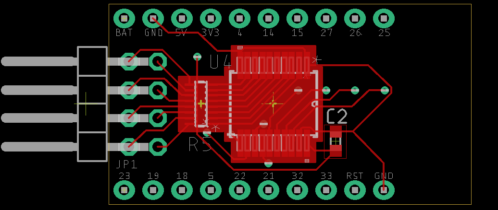
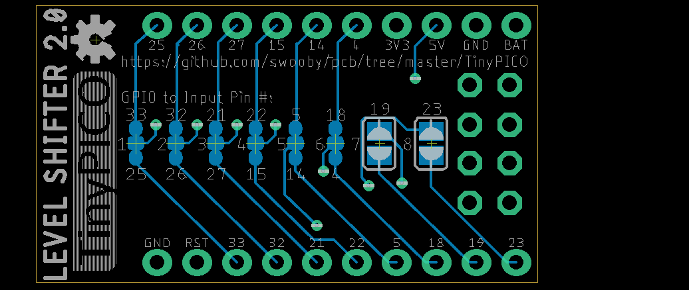
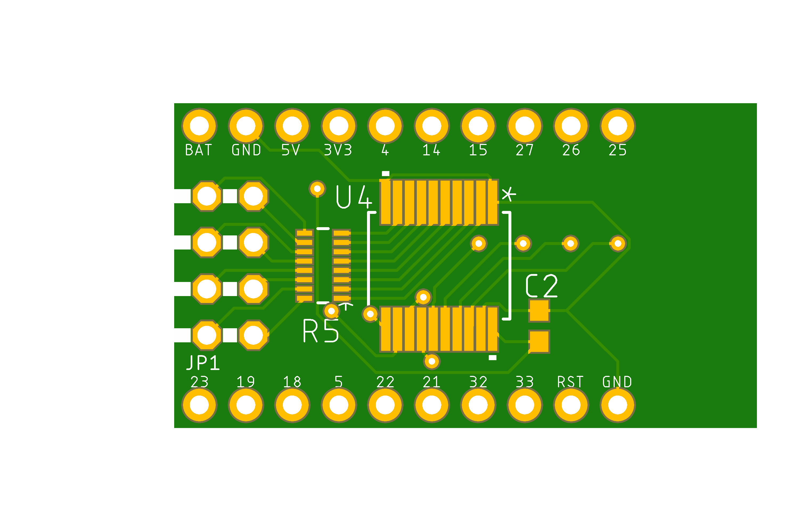
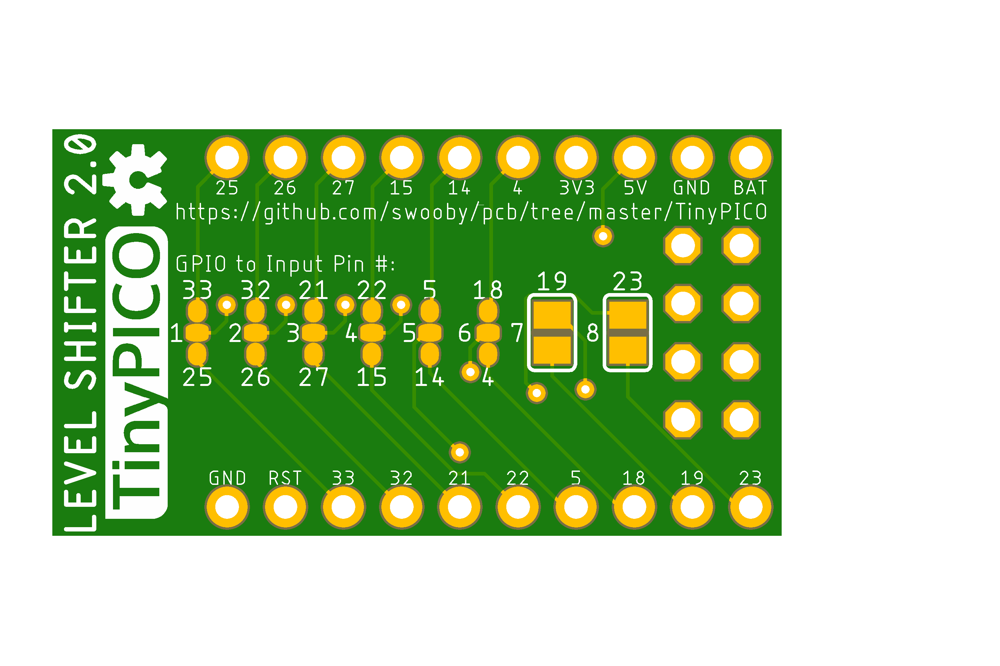
